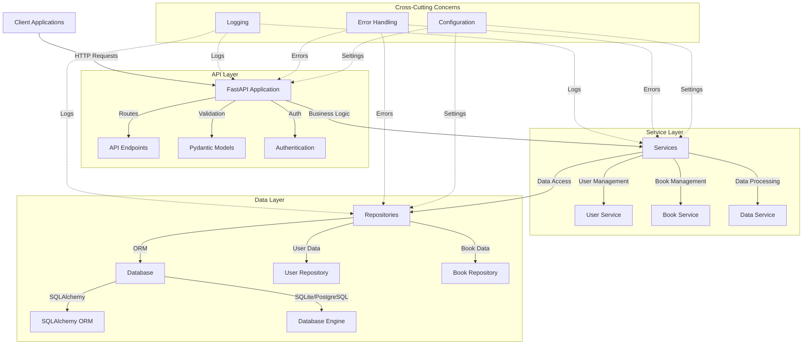
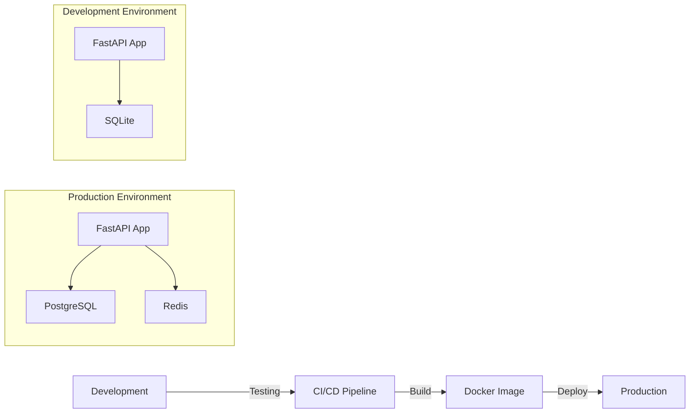

# Application Architecture

This document explains the architecture of the PyPlate FastAPI application, focusing on core components and design patterns.

## Architecture Overview

The PyPlate application follows a layered architecture with clear separation of concerns:



## Error Handling

The application uses a centralized error handling system defined in `app/core/errors.py` that provides:

### Standard Error Response Format

All API errors follow a consistent JSON format:

```json
{
  "status": "error",
  "message": "Error description",
  "details": null  // Optional additional information
}
```

### Custom Exception Classes

The application defines several custom exception classes for specific error types:

| Exception Class | HTTP Status | Purpose |
|-----------------|-------------|---------|
| `NotFoundError` | 404 | Resource not found |
| `ValidationError` | 400 | Invalid input data |
| `AuthenticationError` | 401 | Authentication failed |
| `AuthorizationError` | 403 | Permission denied |
| `DatabaseError` | 500 | Database operation failed |
| `ConflictError` | 409 | Data conflict (e.g., duplicate entry) |

### Usage in Code

Here's how to use these exceptions in your code:

```python
from app.core.errors import NotFoundError

async def get_item(item_id: str, db: AsyncSession):
    item = await db.get(Item, item_id)
    if not item:
        raise NotFoundError(f"Item with id {item_id} not found")
    return item
```

The exception will be automatically caught and converted to an appropriate HTTP response.

### Exception Handlers

The application registers these exception handlers in the FastAPI application:

```python
# In app/main.py
from app.core.errors import setup_exception_handlers

app = FastAPI(...)
setup_exception_handlers(app)
```

## Database Connection

The database connection system is defined in `app/db/session.py` and uses SQLAlchemy 2.0 with async support.

### Configuration

For Phase 1, the application uses SQLite with async support:

```
SQLALCHEMY_DATABASE_URI=sqlite+aiosqlite:///./gutenberg.db
```

This configuration can be customized through environment variables or the `.env` file.

### AsyncSession and Dependency Injection

Database sessions are managed through FastAPI's dependency injection:

```python
from fastapi import Depends
from sqlalchemy.ext.asyncio import AsyncSession

from app.db.session import get_db

@app.get("/items/")
async def get_items(db: AsyncSession = Depends(get_db)):
    # Use the database session...
    return {"items": []}
```

The `get_db` dependency:
1. Creates a new database session
2. Yields it to the endpoint
3. Closes the session after the endpoint completes

### Transaction Management

For proper transaction management:

```python
async def create_item(db: AsyncSession, item_data: dict):
    try:
        item = Item(**item_data)
        db.add(item)
        await db.commit()
        await db.refresh(item)
        return item
    except Exception:
        await db.rollback()
        raise
```

## Models Structure

The application uses SQLAlchemy 2.0-style models with a clean structure defined in `app/db/models/`.

### Base Model

The `Base` class in `app/db/models/base.py` provides common functionality:

- Automatic table naming based on class name
- JSON serialization with the `.dict()` method
- SQLAlchemy metadata with naming conventions

### Useful Mixins

Two important mixins are available:

1. `TimestampMixin`: Adds `created_at` and `updated_at` columns
2. `UUIDMixin`: Adds a UUID primary key column

### Example Model Definition

Here's how to define a new model:

```python
from sqlalchemy import Column, String, ForeignKey
from sqlalchemy.orm import relationship

from app.db.models.base import Base, TimestampMixin, UUIDMixin

class Book(Base, UUIDMixin, TimestampMixin):
    """Book model for Project Gutenberg books."""
    
    title = Column(String, nullable=False, index=True)
    author_id = Column(String, ForeignKey("author.id"))
    
    # Relationships
    author = relationship("Author", back_populates="books")
    
    def __repr__(self) -> str:
        return f"<Book {self.title}>"
```

### Model Registration

All models must be imported in `app/db/models/__init__.py` to be registered with SQLAlchemy:

```python
from app.db.models.base import Base
from app.db.models.user import User
from app.db.models.book import Book
```

## API Structure

The API is versioned and organized in modules inside `app/api/`:

```
app/api/
  └── v1/
      ├── endpoints/       # Route handlers
      │   ├── __init__.py  # Main router
      │   ├── auth.py      # Authentication endpoints
      │   └── books.py     # Book-related endpoints
      │
      └── models/          # Pydantic models
          ├── auth.py      # Auth request/response models
          └── book.py      # Book request/response models
```

### Pydantic Models vs SQLAlchemy Models

- **SQLAlchemy Models** (`app/db/models/`): Define database schema and ORM
- **Pydantic Models** (`app/api/v1/models/`): Define API request/response schemas

### Router Structure

Endpoints are organized by feature and combined in the main router:

```python
# app/api/v1/endpoints/__init__.py
from fastapi import APIRouter
from app.api.v1.endpoints import auth, books

router = APIRouter()
router.include_router(auth.router, prefix="/auth", tags=["auth"])
router.include_router(books.router, prefix="/books", tags=["books"])
```

## Dependency Injection

The application uses FastAPI's dependency injection system to manage dependencies like database sessions, authentication, and services:

```python
from fastapi import Depends
from sqlalchemy.ext.asyncio import AsyncSession

from app.db.session import get_db
from app.services.user import UserService

async def get_user_service(db: AsyncSession = Depends(get_db)) -> UserService:
    """Dependency for user service."""
    return UserService(db)

@app.get("/users/me")
async def get_current_user(
    user_service: UserService = Depends(get_user_service),
    current_user = Depends(get_current_user)
):
    """Get current user information."""
    return current_user
```

## Authentication and Authorization

The application implements JWT-based authentication and role-based authorization:

### JWT Authentication

```python
from fastapi import Depends, HTTPException, status
from fastapi.security import OAuth2PasswordBearer

oauth2_scheme = OAuth2PasswordBearer(tokenUrl="/api/v1/auth/login")

async def get_current_user(token: str = Depends(oauth2_scheme)):
    """Get the current user from the JWT token."""
    # Verify and decode the token
    # Return the user or raise an exception
```

### API Key Authentication

For machine-to-machine communication, API key authentication is available:

```python
from fastapi import Security
from fastapi.security import APIKeyHeader

api_key_header = APIKeyHeader(name="X-API-Key", auto_error=False)

async def get_api_key(api_key: str = Security(api_key_header)):
    """Validate the API key."""
    # Validate the API key
    # Return the associated service or raise an exception
```

## Testing Strategy

The application includes comprehensive tests organized by layer:

1. **Unit Tests**: Testing individual components in isolation
2. **Integration Tests**: Testing interactions between components
3. **API Tests**: Testing the API endpoints
4. **Repository Tests**: Testing database operations

Tests are executed using pytest and are organized in the `app/tests/` directory.

## Deployment

The application is containerized using Docker and can be deployed using Docker Compose or Kubernetes:

